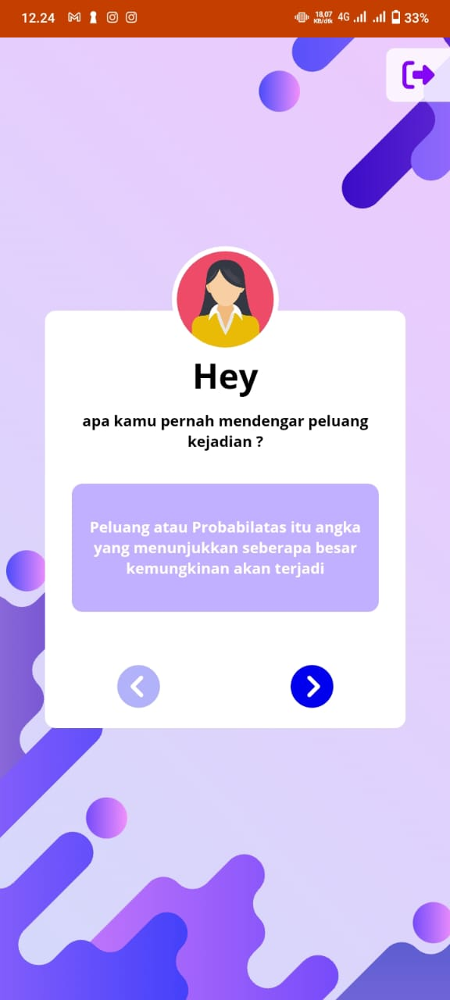

## Math Mobile ( apps )

"Math APP" adalah sebuah aplikasi inovatif yang dirancang khusus untuk membantu siswa kelas 12 dalam memahami konsep matematika dengan lebih baik. Dengan antarmuka yang ramah pengguna, aplikasi ini memberikan pengalaman pembelajaran yang interaktif dan menyenangkan bagi pengguna.

## Fitur:
    
- Modul Pembelajaran Interaktif

- Latihan Soal yang Terpersonalisasi

- Video Pembelajaran Interaktif

Math APP adalah solusi lengkap untuk kebutuhan pembelajaran matematika kelas 12. Dengan menggabungkan teknologi dan pendekatan pembelajaran yang inovatif, aplikasi ini membantu siswa mengembangkan pemahaman yang mendalam hehe 😊

🔴 Peringatan : (Not Responsif Web) Buka dalam mode mobile !!

### Listen ON : <a href="pintarmenghitung.nichesite.or" targer="_blank">Here</a>
    pintarmenghitung.nichesite.org

## Preview

  

## About Laravel

Laravel is a web application framework with expressive, elegant syntax. We believe development must be an enjoyable and creative experience to be truly fulfilling. Laravel takes the pain out of development by easing common tasks used in many web projects, such as:

    Copyright ©2023 Yohanes Oktanio, All Rights Reserved
